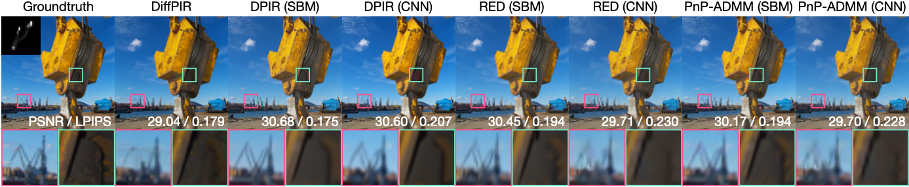

# Plug-and-Play Priors as a Score-Based Method

<!--  -->
<!--  -->
<!--


-->

[[arXiv]](https://arxiv.org/abs/2412.11108)




## Abstract
Plug-and-play (PnP) methods are extensively used for solving imaging inverse problems by integrating physical measurement models with pre-trained deep denoisers as priors. Score-based diffusion models (SBMs) have recently emerged as a powerful framework for image generation by training deep denoisers to represent the score of the image prior. While both PnP and SBMs use deep denoisers, the score-based nature of PnP is unexplored in the literature due to its distinct origins rooted in proximal optimization. This letter introduces a novel view of PnP as a score-based method, a perspective that enables the re-use of powerful SBMs within classical PnP algorithms without retraining. We present a set of mathematical relationships for adapting popular SBMs as priors within PnP. We show that this approach enables a direct comparison between PnP and SBM-based reconstruction methods using the same neural network as the prior.


## Environment setting

### 1) Clone the repository
```
git clone https://github.com/wustl-cig/score_pnp

cd score_pnp
```

### 2) Download Pretrained Score Function

- Download **DnCNN denoiser** trained on the ImageNet 256x256 dataset [Pretrained DnCNN link](https://huggingface.co/deepinv/dncnn/resolve/main/dncnn_sigma2_color.pth?download=true). The default save directory is `./pretrained_models`.
- Download **DRUNet denoiser** trained on the ImageNet 256x256 dataset [Pretrained DRUNet link](https://huggingface.co/deepinv/drunet/resolve/main/drunet_color.pth?download=true). The default save directory is `./pretrained_models`.
- Download **variance-preserving score neural network** trained on the ImageNet 256x256 dataset [Pretrained VP score link](https://drive.google.com/drive/folders/1jElnRoFv7b31fG0v6pTSQkelbSX3xGZh). The default save directory is `./pretrained_models`.

### 2) Download blurring kernel

- Download blur kernels **Levin09.npy** [Blur kernels link](https://github.com/ofsoundof/GRL-Image-Restoration/blob/3123fcadfee2107d813c5e8fff58227f14c989bc/utils/blur_kernels/Levin09.npy). The default save directory is `./blur_kernels`.


### 3) Virtual environment setup
```
conda create -n Scorepnp python=3.9.19

conda activate Scorepnp

pip install -r requirements.txt
```

## Run experiment

### 1) Pick one task from `configs` directory:

#### Score-based PnP approches

  - `configs/dpir_score.yaml`
  - `configs/red_score.yaml`
  - `configs/pnpadmm_score.yaml`
  - `configs/diffpir_score.yaml`

#### Classical PnP approches

  - `configs/dpir_classical.yaml`
  - `configs/red_classical.yaml`
  - `configs/pnpadmm_classical.yaml`

### 2) Open `yaml` file and customize `# CUSTOMIZE`

```
# Open up the yaml file that you want to run experiment
vim {TASK_YAML_FILE_NAME}.yaml

# Only care the line that has `# Attention #`
gpu:  # CUSTOMIZE 1
pretrained_check_point:  # CUSTOMIZE 2
```

### 3) Execute the code
```
python3 first_argparse.py --task_config configs/{TASK_YAML_FILE_NAME}.yaml    # example code: python3 first_argparse.py --task_config configs/score_dpir.yaml
```

## Implementation detail

```
first_argparse.py                  # Read yaml file / set forward operator and data transform / initialize models
│   
├────────── second_dpir.py         # [DRUNet / Score]-based DPIR operation
│   
├────────── second_red.py          # [DnCNN / Score]-based RED operation
│   
├────────── second_pnpadmm.py      # [DnCNN / Score]-based PnP-ADMM operation
│   
└────────── second_diffpir.py      # DiffPIR operation
```

<h2 style="color:red;">Troubleshooting</h2>

```diff
! If you encounter any issues, feel free to reach out via email at chicago@wustl.edu. 
```


## Code references

We adopt the code structure from [Deepinverse repo](https://deepinv.github.io/deepinv/index.html).

## Citation

```
@article{park2024scorepnp,
	  title={Plug-and-Play Priors as a Score-Based Method},
	  author={Park, Chicago Y.
    and Yuyang Hu
		and McCann, Michael T.
		and Garcia-Cardona, Cristina
		and Wohlberg, Brendt
		and Kamilov, Ulugbek S.},
	  journal={arXiv preprint arXiv:2412.11108},
	  year={2024}
	}
```

